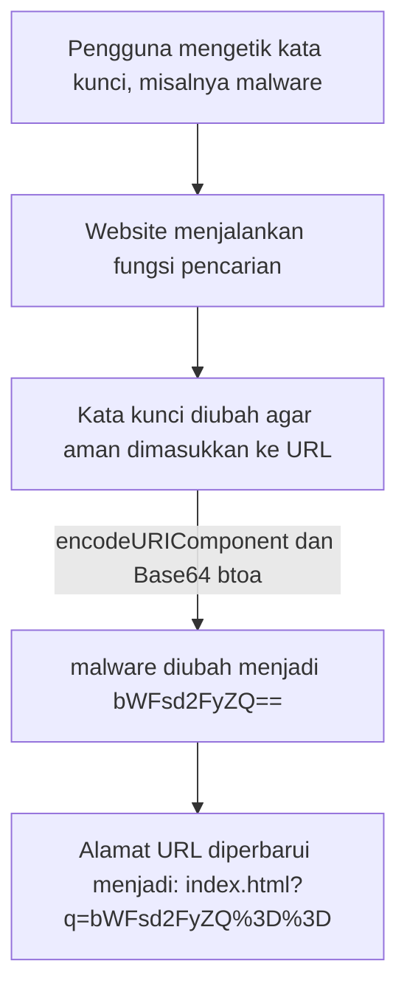

# Secnotes 
Sebuah website sederhana berbasis **HTML, CSS, dan JavaScript** yang menyajikan artikel serta berita seputar dunia **cyber security**.  
Website ini juga dibuat dengan tujuan edukasi, khususnya untuk mendemonstrasikan bagaimana mekanisme **encoding Base64** dapat digunakan pada URL (misalnya dalam fitur pencarian).

## Teknologi yang digunakan
  

## Tujuan
Menyediakan artikel/artikel singkat terkait keamanan siber, memberikan contoh praktis penggunaan **Base64 encoding** dalam sebuah aplikasi web sederhana, menjadi proyek demonstrasi edukasi bagi pembelajar cyber security dan web development.  

## Cara Kerja Encoding Base64 di Website Ini
Website ini menggunakan **Base64 encoding** pada fitur pencarian artikel. <br>
Tujuannya adalah untuk mendemonstrasikan bagaimana sebuah query teks (input dari user) bisa di-*encode* agar lebih aman digunakan di URL.

### Proses Encoding
Pada file `script.js`, terdapat fungsi berikut:

```js
function encodeSearch(query) {
    return btoa(encodeURIComponent(query));
}
```
- ```encodeURIComponent(query)``` → memastikan karakter khusus (misalnya spasi, &, %, #) tidak merusak format URL.
- ```btoa(...)``` → melakukan konversi string menjadi Base64.

Fungsi ini dipanggil saat user menekan tombol Cari pada form pencarian, tepatnya di bagian:
```js
const encodedQuery = encodeSearch(query);
const newURL = `${window.location.pathname}?q=${encodedQuery}`;
```

### Contoh Alur
Berikut alur bagaimana proses Base64 encoding bekerja pada fitur pencarian:



#### Maksud dari encodeURIComponent + Base64 (btoa)?
Ketika user mengetik kata kunci (misalnya malware), program tidak langsung menaruh teks itu ke alamat URL.
Supaya aman dan bisa dibaca dengan benar di browser, program melakukan dua langkah encoding :
```js 
encodeURIComponent(query)
```
Ini adalah fungsi bawaan JavaScript. Tugasnya memastikan karakter-karakter khusus (spasi, tanda &, %, #, dll) diubah menjadi bentuk aman di URL.

Contoh : <br>
```Input: phishing attack```
```Output: phishing%20attack```

```btoa(...) (Base64 encoding)```
Fungsi bawaan JavaScript untuk mengubah teks biasa menjadi string Base64.
Base64 membuat teks jadi “kode” yang hanya berisi huruf, angka, +, /, dan = → karakter-karakter yang aman untuk disimpan atau dikirim.

Contohnya yaitu :
```Input: malware```
```Output: bWFsd2FyZQ==```


